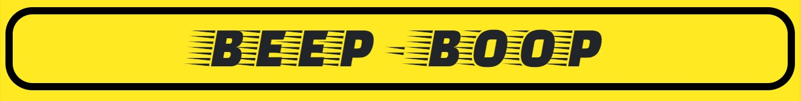
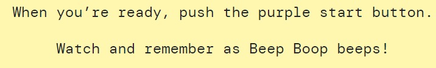

# Beep - Boop
### An audio / visual memory game

## Tablee of Contents

[User Experience - UX](#UX)

[Design](#design)

[Features](#features)

[Languages and Technologies](#tech)

[Testing](#testing)

[Deployment](#deployment)

[Credits](#credits)

## UX
### User Profiles
As a user of this website, I am someone looking for a quick and fun memory game to play. I could be of any age over the age of around 4 years old, with at least a basic understanding of English.

### User Stories
As a user of the website, I want:
* To play a memory game
* To interact with the website and gain immediate feedback from my interaction
* The game to be simple to understand and play
* To be able to read the game instructions should I need them
* To be able to change the difficulty of the game to be easier or harder
* To be able to play the game with or without sounds
* To be able to play the game on any device

## Design
The overall design concept of the website was to make a memory game with the aesthetic of a physical toy that may have been manufactured in the 1980's. The general idea of the game is based heavily on the game 'Simon' which was first manufactured in 1978.
The game and all navigational features fit within a container which stays the same size as the user navigates throught the website. This gives the impression of there being a solid and material object on the page. The game container features a subtle inset box shadow, used to add to the illusion of the game being a 3D object. As well as this, all buttons feature an offset box shadow which gives the impression they are elevated from the background. This box shadow effect is removed when the buttons are clicked to seem as though the button has physically moved. When the buttons found on the main game page light up, a radial gradient effect is used to suggest that there is a light bulb in the center of the button. As well as this, a box shadow effect is used to suggest that the immediate area surrounding the button is being illuminated by the button (see image below).

### Wireframes

### Colour Scheme
The colour scheme for the website began with the concept of using yellow for the body of the game and purple for the background. These colours were chosen because of their stark contrast from each other due to being opposites on the colour spectrum. The bright yellow of the game naturally draws the users eye to it when set against the purple background. The background itself was then made to look more fun and exciting with the addition of colourful geometric shapes which also adds to the 80's aesthetic of the page.
The colour palette for the buttons found within the game (excluding the purple 'START' button and light yellow 'MAIN MENU') were derived from a palette generated by the website https://www.coolors.co/. The picture below displays the colour chart provided by the website.

This palette was chosen as it contains 4 distinct colours that could be used for the four 'light-up' buttons found in the game. The colours were used as a basis, before being darkened slightly in order to accentuate the difference when the buttons are 'lit-up'.

### Fonts

The font used for the 'BEEP - BOOP' logo is 'Faster One' from Google Fonts. This was used as it is a striking font, with the trailing lines alluding to speed and movement.

The majority of the text on the website is 'Bungee' from Google Fonts. This font was chosen as it is bold and clearly legible, as well as being somewhat reminiscent of the font used for the Pacman computer games, which suits the 80's theme of the website. The font used for the tagline 'An audio / visual memory game' is 'Bungee Shade', also from Google Fonts.

For more verbose sections of the website, the font 'DM Mono' from Google Fonts was used as it has a vaguely digital feel to it which suits the computer game aesthetic, whilst remaining clearly legible. This font can be found in the 'How to play' modal, as well as in the descriptions of the difficulty options.

The font 'Digital-7' was used in the level display to give the effect of it being an old LCD display, similar to that found on calculators. This helped add to the illusion of the website actually being a physical toy.

## Features
### Implemented Features

#### Index.html

#### difficulty.html

#### game.html

#### Potential Future Features

## Languages and Technologies  Used

## Testing

### Testing against user requirements (as listed in UX section)

### Manual testing of all elements throughout the website
List of features/pages and how I tested them...

### Additional Testing
Friends/family/slack

### Known Bugs

## Deployment
### Deployment to GitHub pages
The website was deployed to GitHub pages using the following process:

1. Log in to the GitHub website and select the 'beep-boop' repository  from the list in the top left of the screen.

2. Once viewing the repository , click on 'Settings' which can be found in the navigation bar above the list of files and folders.

3. Scroll down to the 'GitHub Pages' section and under the 'Source' heading find the dropdown menu (default value is 'None'). Click on the dropdown menu and select 'master' from the list.

4. To the right of the dropdown menu, click the 'Save' button. The website is now deployed.

To find the link to the newly deployed site, follow these steps:

1. Navigate to the repository's main screen (see step 1 of the deployment process).

2. To the right of the screen, click on the 'github-pages' under the 'Environments' heading.

3. Click on the 'View Deployment' button to the right of the screen. This will launch the website with the link which can now be used by anyone to view it.

### Forking the Repository
If you wish to work on this project within your own repository, it can be forked using the following proccess:

1. Log in to your GitHub account on the GitHub website.

2. Using the search bar in the top left of the screen, search for 'richardthorp/beep-boop'.

3. Click on the search result and then click on the 'Fork' button to the right of the screen, above the list of files and folders.

4. The repository is now 'forked' and saved in your own repository.

### Cloning the Repository
If you wish to clone the repository to work on locally, follow these steps:

1. Log in to GitHub and navigate to the repository (follow step 2 from 'Forking the Repository').

2. Click on the green 'Code' button to the top right of the list of files and folders.

3.  Copy the URL displayed underneath the underlined 'HTTPS'.

4. In your local IDE, launch Git Bash and create or navigate to the folder in which you wish to make the clone.

5. On the CLI type 'git clone' followed by the URL copied from step 3 and press enter. You will now have a local clone of the repository.

## Credits

### Code

### Content

### Acknowledgements
