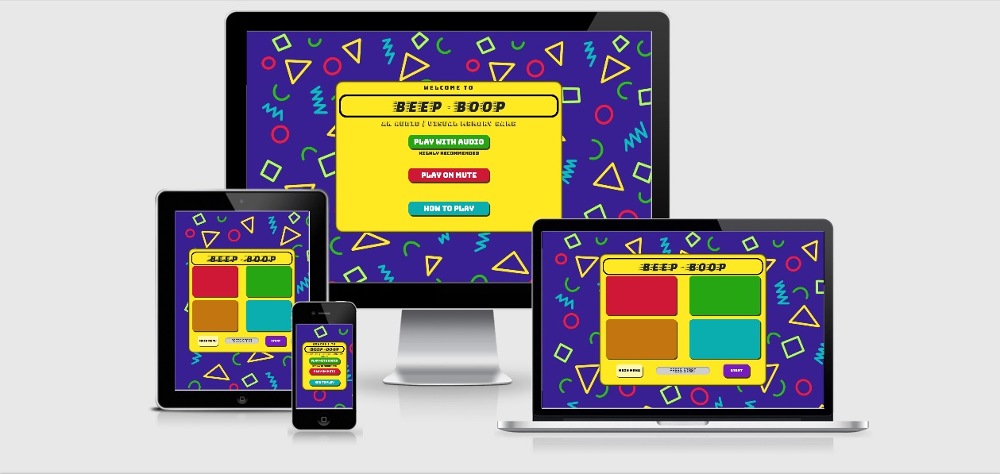
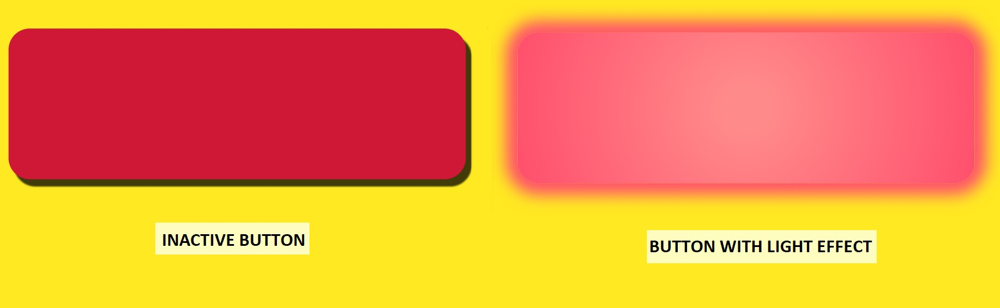
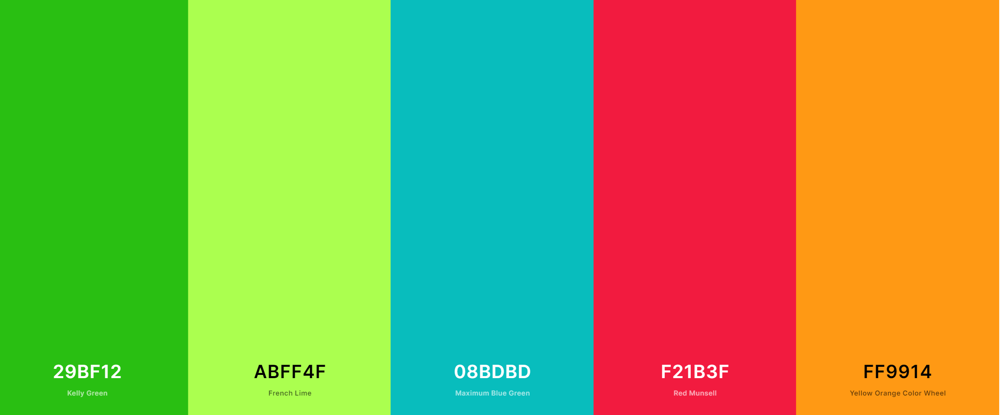

# Beep - Boop
### An audio / visual memory game
[Click here to view live website](https://richardthorp.github.io/beep-boop/index.html)
## Table of Contents

[User Experience - UX](#UX)

[Design](#design)

[Features](#features)

[Languages and Technologies](#tech)

[Testing](#testing)

[Deployment](#deployment)

[Credits](#credits)

## UX
### User Profiles
As a user of this website, I am someone looking for a quick and fun memory game to play. I could be of any age over the age of around 6 years old, with at least a basic understanding of English.

### User Stories
As a user of the website, I want:
* To play a memory game
* To easily understand how to navigate the website
* To interact with the website and gain immediate feedback from my interaction
* The game to be simple to understand and play
* To be able to read the game instructions should I need them
* To be able to change the difficulty of the game to be easier or harder
* To be able to play the game with or without sounds
* To be able to play the game on any device

## Design
The overall design concept of the website was to make a memory game with the aesthetic of a physical toy that may have been manufactured in the 1980's. The general idea of the game is based heavily on the game 'Simon' which was first manufactured in 1978.
The game and all navigational features fit within a container which stays the same size as the user navigates through the website. This gives the impression of there being a solid and material object on the page. The game container features a subtle inset box shadow, used to add to the illusion of the game being a 3D object. As well as this, all buttons feature an offset box shadow which gives the impression they are elevated from the background. This box shadow effect is removed when the buttons are clicked to seem as though the button has physically moved. When the buttons found on the main game page light up, a radial gradient effect is used to make the centre of the button the brightest, with the brightness slowly fading outwards. This is to suggest that there is a light bulb in the centre of the button. As well as this, a box shadow effect is used to suggest that the immediate area surrounding the button is being illuminated by the button (see image below).

### Design mock-ups
[Click here to see index.html mock-ups](assets/images/readme-images/index-mockups.jpg)

[Click here to see difficulty.html mock-ups](assets/images/readme-images/difficulty-mockups.jpg)

[Click here to see game.html mock-ups](assets/images/readme-images/game-mockups.jpg)

### Colour Scheme
The colour scheme for the website began with the concept of using yellow for the body of the game and purple for the background. These colours were chosen because of their stark contrast from each other due to being opposites on the colour spectrum. The bright yellow of the game naturally draws the user's eye to it when set against the purple background. The background itself was then made to look more fun and exciting with the addition of colourful geometric shapes which also adds to the 80's aesthetic of the page.
The colour palette for the buttons found within the game (excluding the purple **'START'** button and light yellow **'MAIN MENU'**) were derived from a palette generated by the website https://www.coolors.co/. The picture below displays the colour chart provided by the website.

This palette was chosen as it contains 4 distinct colours that could be used for the four 'light-up' buttons found in the game. The colours **'Kelly Green' #29BF12**, **'Maximum Blue Green' #08BDBD**, **'Red Munsell' F21B3F** and **'Yellow Orange Color Wheel' #FF9914** were used as a basis, before being darkened slightly in order to accentuate the difference when the buttons are 'lit-up'.

### Fonts
The font used for the 'BEEP - BOOP' logo is **'Faster One'** from Google Fonts. This was used as it is a striking font, with the trailing lines alluding to speed and movement. [Click here to view logo.](assets/images/readme-images/logo.jpg)

Most of the text on the website is **'Bungee'** from Google Fonts. This font was chosen as it is bold and clearly legible, as well as being somewhat reminiscent of the font used for the Pacman computer games, which suits the 80's theme of the website. The font used for the tagline **'An audio / visual memory game'** is **'Bungee Shade'**, also from Google Fonts. [Click here to view Bungee font in use.](assets/images/readme-images/bungee-font.jpg)

For more verbose sections of the website, the font **'DM Mono'** from Google Fonts was used as it has a vaguely digital feel to it which suits the computer game aesthetic, whilst remaining clearly legible. This font can be found in the **'How to play'** modal, as well as in the descriptions of the difficulty options. [Click here to view DM mono font in use.](assets/images/readme-images/dm-mono-font.jpg)

The font **'Digital-7'** was used in the level display to give the effect of it being an old LCD display, similar to that found on calculators. This helped add to the illusion of the website being a physical toy. [Click here to view the level display.](assets/images/readme-images/level-display.jpg)

## Features
### Implemented Features
The website features 3 separate pages (**index.html**, **difficulty.html** and **game.html**). Each of these pages contains a single container that holds all the necessary elements required to navigate around the website and interact with the game. This container and its contents are responsive to the user's device viewport, and the container is always the same dimensions across the 3 pages. All navigational elements have mouse hover effects to reassure the user that they are indeed clickable links.

#### Index.html
This is the landing page for the website. The user is immediately presented with the game logo, followed by the tagline 'An audio / visual memory game' thus establishing the purpose of the website very quickly. Below this are 3 clearly labelled buttons:

**PLAY WITH AUDIO** (Highly recommended) - By clicking on this button, the user moves through to the next page of the website (**difficulty.html**). The button also sets the key/value pair of **"audio: 'true'"** to the user's browsers session storage. This item is then evaluated in the JavaScript code, to determine whether audio is triggered when playing the game. 

**PLAY ON MUTE** - This functions the same way as the **'PLAY WITH AUDIO'**  button, however the key/value pair are set to **"audio: 'false'"**.

**HOW TO PLAY** - This button triggers a modal, which contains a short set of instructions on how to play the game. The modal can be closed either by clicking on the **'CLOSE'** button, or by clicking anywhere outside of the modal body.

If the session storage item is not set (i.e. the user goes straight to **game.html**), the game defaults to audio being enabled as this is the recommended way to play the game.

#### difficulty.html
Once through to this page, the user is asked to **'SELECT DIFFICULTY'** and presented with a further 3 buttons titles **'EASY'**, **'NORMAL'** and **'HARD'**. Each button is accompanied by a short description of what each difficulty option entails. Again, by clicking on one of these buttons, a session storage item is set which is later evaluated in the JavaScript code and used to determine certain factors of the user's game experience.

Below these three buttons, a more subtle button is offered to return the user to the **'MAIN MENU'** which links back to **index.html**. This ensures good UX as the user cannot get 'trapped' on this page and can return to the main menu to check how to play the game or select a different audio setting.

#### game.html
The **game.html** page contains the actual game aspect of the website. Below the BEEP - BOOP logo, the user finds 4 large buttons of varying colours. These are the buttons with which the user plays game. Beneath this, is another button which links the user back to the main menu. This button is styled in the same manner as the main menu link found on **difficulty.html** to ensure consistency throughout the website. Next to the main menu link is a level display which initially prompts the user to **'PRESS START'**, and then once the game has begun displays the current level of the game. Next to this is the **'START'** button which triggers the start of the game.

Should the user be successful in completing the game, a 'success jingle' is triggered, the game buttons flash 2 times and the level display text changes to "YOU WON!". Following this, a modal pops up to congratulate the user and if the game was played on easy or normal difficuly, suggests playing again on a higher difficulty with a link to difficulty.html. Should the user lose the game, a 'fail jingle' and all the game buttons flash 2 times and the level display text changes to "GAME OVER!". Following this, a modal pops up to say the game is over, inform the user of which level they reached, and if played on easy or normal difficulty, suggests playing the game on an easier difficulty with a link to difficulty.html.

#### 404.html
The **404.html** page is a custom 404 error response page should the user mis-type the URL. The page informs the user "There is no BEEP - BOOP here!" and provides a link to the main menu (index.html).

#### Potential Future Features
I think that the game and its features are best kept simple, however in the future I may look at adding 'lives' to the game that allow the user to replay a level without starting from level 1 should they make a mistake. The number of lives allowed could change depending on the difficulty level chosen by the user.

Another idea would be to allow the user to set their own difficulty level by setting the length of the interval in between beeps, and by choosing how many beeps are required to complete the game.

## Languages and Technologies  Used
This website is written in HTML, CSS and JavaScript.

### Technologies Used
1. [Gitpod](https://www.gitpod.io/)
   * The IDE used to write the code for the website.
   
3. [Git](https://git-scm.com)
   * Used for version control during the website build via the command terminal in Gitpod
   
3. [GitHub](https://pages.github.com/)
   * Used to store the code after being 'committed' and 'pushed' using Git. The website is now hosted via GitHub pages.
   
3. [Bootstrap](https://www.getbootstrap.com/)
   * Used to create structure and some styling, as well as some responsive aspects of the website. Also, the modals found on index.html and game.html are powered by Bootstrap code.
   
4. [jQuery](https://www.jquery.com/)
   * jQuery is required to power certain Bootstrap features, including the index.html modal. jQuery is also used to shorten the syntax required to achieve certain functions, such as targeting HTML elements within the JavaScript file. jQuery also improves the readability of the scripts.js file
   
5. [Google Fonts](https://fonts.google.com/)
   * Used to provide the 'Faster One', 'Bungee', 'Bungee Shade' and 'DM Mono' fonts used throughout the website.
   
6. [1001 Fonts](https://www.1001fonts.com/)
   * Used to provide the 'Digital-7' font found in the level display in game.html.
   
7. [Coolors](https://coolors.co/)
   * Used to generate the colour palette from which the colours on the website are derived.
   
8. [Figma](https://www.figma.com/)
   * Software used to create mock-ups of website.
   
9. [Autoprefixer](https://autoprefixer.github.io/)
   * Used to ensure cross browser validity for CSS.
   
10. [Am I Responsive?](http://ami.responsivedesign.is/)
    * Used to test for responsive design and to create mock-ups found at the top of this README.
   
11. [Audacity](https://www.audacityteam.org/)
    * Used to edit all the audio found on the website.
    
12. [CSSmatic](https://www.cssmatic.com/box-shadow)
    * Used to create box shadow effect.
    
13. [CSS Gradient](https://cssgradient.io/)
    * Used to create radial gradient effect.
    
14. [Font Squirrel](https://www.fontsquirrel.com/)
    * Used to convert .ttf font file into woff and woff2 font file formats.
    
15. [Chrome DevTools](https://developers.google.com/web/tools/chrome-devtools)
    * Used to test responsivity of website and test contrast between backgrounds and fonts.
    

## Testing
### Testing against user requirements (as listed in UX section)
* To play a memory game
  * This requirement is met by the website by providing a memory game!
  
* To interact with the website and gain immediate feedback from my interaction
  * The game responds to user clicks with immediate audio and visual feedback. If the user successfully completes the game, the level display shows **"YOU WIN!"** and a triumphant 8-bit jingle is sounded. If the user makes a mistake, the level display shows **"GAME OVER!"** and a game-over jingle sounds. The game-over jingle is reminiscent  of classic old-school arcade game game-over sounds. Outside of the game itself, all clickable links have hover effects to reassure the user that they are indeed clickable links hen the mouse is moved over them.
  
* The game to be simple to understand and play
  * The game is a very simple concept taken from the game 'Simon'. Whilst anyone familiar  with the game 'Simon' would immediately understand how to play, even without prior knowledge the user can quickly come to understand the rules of the game due to its simple nature and audio/visual feedback.
  
* To be able to read the game instructions should I need them
  * Should the user not understand the game, there is a clear **"HOW TO PLAY"** button presented on the landing page for the website. This page is easily accessible from anywhere on the website.

* To be able to play the game with or without sounds
  * This option is presented to the user immediately upon loading the website. On **index.html** 2 buttons clearly state **"PLAY WITH AUDIO"** or **"PLAY ON MUTE"**. This page (signposted as **"MAIN MENU"**) is clearly accessible from anywhere within the website.
  
* To be able to change the difficulty of the game to be easier or harder
  * Having selected the audio setting, the users are presented with **difficulty.html**. On this page there are 3 buttons labelled **"EASY"**, **"NORMAL"** and **"HARD"**. Beneath the buttons is a short description of what each difficulty setting means.
  
* To be able to play the game on any device
  * The website has been designed and tested with the aim of enabling the game to be played on as many devices as possible. With this in mind, the CSS code has been made as cross browser compatible as possible with the help of [Autoprefixer](https://autoprefixer.github.io/). All code has been validated through [JS Hint](https://jshint.com/) for JavaScript, [W3C's](https://www.w3.org/) CSS and HTML validators. As well as this, the pages are all highly responsive with the design being suitable for devices of around a 270px square upwards.

### Validation
The HTML code has been checked against the [W3C Markup Validator](https://validator.w3.org/), the CSS against the [W3C CSS Validator](https://jigsaw.w3.org/css-validator/) and the JavaScript against the [JS Hint](https://jshint.com/) code analysis tool, with any issues highlighted by the validators fixed. The code contains no validity issues.

### Responsive testing
The website has been developed and tested to ensure a high level of responsiveness. This has been achieved using Google Chrome Dev Tools, testing on different physical devices and by viewing the site on [Am I Responsive?](http://ami.responsivedesign.is/).

### Manual testing of all elements throughout the website
The tests detailed in this section were all completed using the following web browsers and hardware:
|                            | Chrome             | Edge             | Firefox            | Safari |
| -------------             |:------------------:| -----------------:|-------------------:|--------:|
| Microsoft Surface 3 (15") | :heavy_check_mark: |:heavy_check_mark: | :heavy_check_mark: |         |
| Samsung Galaxy A6         | :heavy_check_mark: |:heavy_check_mark: | :heavy_check_mark: |         |
| Huawei P Smart 2019       | :heavy_check_mark: | :heavy_check_mark:| :heavy_check_mark: |         |
| Macbook Pro 2016 (13")    | :heavy_check_mark: |                   | :heavy_check_mark: |:heavy_check_mark: |
| iPad 7th generation 2019  | :heavy_check_mark: |                  | :heavy_check_mark: |:heavy_check_mark: |

#### Index.html tests
Check that all text and buttons load with correct styles and spacing, and that the container is centred within the page. On mobile and tablet, rotate the screen to landscape orientation and repeat the checks.

##### "PLAY WITH AUDIO" button
1. Move mouse over button 
    * ensure hover effect is active.
2. Click on the button
    * Check that the box shadow effect is removed to give impression of button being pressed.
    * Check that button links to **difficulty.html**.
    * Within the console, ensure **"audio: 'true'"** has been saved to session storage.
  
##### "PLAY ON MUTE" button
1. Move mouse over button 
    * ensure hover effect is active.
  
2. Click on the button
    * Check that the box shadow effect is removed to give impression of button being pressed.
    * Check that button links to **difficulty.html**.
    * Within the console, ensure **"audio: 'false'"** has been saved to session storage.
  
##### "HOW TO PLAY" button
1. Move mouse over button 
    * ensure hover effect is active.
  
2. Click on the button
    * Check that the box shadow effect is removed to give impression of button being pressed.
    * Check that button triggers the **'HOW TO PLAY'** modal.

##### "HOW TO PLAY" modal
1. Display the modal using the **"HOW TO PLAY"** button
    * Check that the text and **"CLOSE"** button load with correct styles and spacing, and that the container is centred within the page. On mobile and tablet, rotate the screen to landscape orientation and repeat the checks.
  
2. Move mouse over **"CLOSE"** button 
    * ensure hover effect is active.
  
3. Click on the **"CLOSE"** button
    * Check that the box shadow effect is removed to give impression of button being pressed.
    * Ensure the modal is successfully closed.
  
4. Open modal and click outside of modal body
    * Ensure the modal is successfully closed.
  
#### Difficulty.html
Check that all text and buttons load with correct styles and spacing, and that the container is centred within the page. On mobile and tablet, rotate the screen to landscape orientation and repeat the checks.

##### "EASY" button
1. Move mouse over button 
   * ensure hover effect is active.
  
2. Click on the button
   * Check that the box shadow effect is removed to give impression of button being pressed.
    * Within the console, check that **"difficulty: 'easy'"** is saved to session storage.
  
##### "NORMAL" button
1. Move mouse over button 
    * ensure hover effect is active.
  
2. Click on the button
    * Check that the box shadow effect is removed to give impression of button being pressed.
    * Within the console, check that **"difficulty: 'normal'"** is saved to session storage.

##### "HARD" button
1. Move mouse over button 
    * ensure hover effect is active.
  
2. Click on the button
   * Check that the box shadow effect is removed to give impression of button being pressed.
   * Within the console, check that **"difficulty: 'hard'"** is saved to session storage.

##### "MAIN MENU" button
1. Move mouse over button 
   * ensure hover effect is active.
  
2. Click on the button
   * Check that the box shadow effect is removed to give impression of button being pressed.
   * Check that the button links to **index.html**.

#### Game.html
Check that all text and buttons load with correct styles and spacing, and that the container is centred within the page. On mobile and tablet, rotate the screen to landscape orientation and repeat the checks.

For the purpose of speeding up testing, the number of beeps required to win was significantly lowered for all difficulty settings within the scripts.js file. In order to ensure the session storage was having the desired different outcomes whilst playing the game, 'Easy' mode required 3 successful repetitions, 'Normal' mode required 4 and 'Hard' mode required 5.

##### Game buttons (red, green, orange, blue)
1. Click on buttons
    * Play series of games, ensuring each of the buttons have been utilised within the games. 
    * Ensure the buttons trigger the correct audio and visual response.

##### "START" button
1. Move mouse over button 
    * ensure hover effect is active.
    
2. Click on the button
   * Check that the box shadow effect is removed to give impression of button being pressed.
   * Check that the button starts a new game.
   
##### Level display 
1. Play a game
    * Ensure the level display shows the correct level, and updates when new levels are reached.

2. Lose a game
    * Ensure the level display shows the text **"GAME OVER"**.
    
3. Win a game
    * Ensure the level display shows the text **"YOU WIN"**.
    
4. Click on **"START"** button during **winGame()** or **loseGame()** animation
    * Ensure level display shows **"PLEASE WAIT"** until animation is complete, then displays **"PRESS START"**.
    
5. Click on a game button whilst it's not the users turn
    * Ensure the level display shows **"PLEASE WAIT"** until it's the users turn, then display the current level.
    
##### "MAIN MENU" button
1. Move mouse over button 
   * ensure hover effect is active.
  
2. Click on the button
   * Check that the box shadow effect is removed to give impression of button being pressed.
   * Check that the button links to **index.html**.

##### Win game modal
1. Move mouse over button 
   * ensure hover effect is active.
   
2. Move mouse over link 
   * ensure hover effect is active.
   
3. Win a game on easy or normal difficulty
    * Ensure the **"YOU WIN"** modal is triggered
    * On the modal, ensure link to **difficulty.html** is presented.
    
4. Win a game on hard difficulty
    * Ensure the **"YOU WIN"** modal is triggered
    * On the modal, ensure the "Congratulations..." text is presented.
    
5. Click on the **"CLOSE"** button
    * Check that the box shadow effect is removed to give impression of button being pressed
    * Ensure the modal is successfully closed.
  
6. With the modal visible, click outside of modal body
    * Ensure the modal is successfully closed.

##### Lose game modal
1. Move mouse over button 
   * ensure hover effect is active.
   
2. Move mouse over link 
   * ensure hover effect is active.
   
3. Lose a game on normal or hard difficulty
    * Ensure the **"YOU LOST"** modal is triggered
    * On the modal, ensure link to **difficulty.html** is presented.
    
4. Lose a game on easy difficulty
    * Ensure the **"YOU LOST"** modal is triggered
    
5. Click on the **"CLOSE"** button
    * Check that the box shadow effect is removed to give impression of button being pressed
    * Ensure the modal is successfully closed.
  
6. With the modal visible, click outside of modal body
    * Ensure the modal is successfully closed.
    
##### Testing JavaScript functions and logic
1. Testing session storage data and outcomes
    * Navigate from **index.html** to **difficulty.html** using the **"PLAY WITH AUDIO"** button. On **difficulty.html**, navigate to **game.html** using **"EASY"** button.
    * Within the console in **game.html**, check session storage for **"audio: 'true'**, **difficulty: 'easy'**.
    * Using the **"START"** button, begin the game and check that the interval between beeps is as expected.
    * Ensure that the audio is playing.
    * Complete 3 successful repetitions and ensure the **winGame()** function is called.
    
Repeat these tests for all difficulty settings ensuring that the session storage data is correct for each instance. Ensure that the number of repetitions to win the game and the interval between beeps is as expected. Repeat for all difficulty settings again having selected **"PLAY ON MUTE"** from **index.html**, also ensuring that no audio is triggered.

2. Testing game functions (after pressing **"START"** button)
    * Ensure game begins.
    * Successfully repeat computer sequence - ensure a new round is started and that it is one beep longer than the previous round.
    * Enter incorrect sequence - ensure that the game ends and **gameOver()** is called and functions correctly.
    * Complete the game - ensure the **gameWin()** is called and functions correctly.
    * Press **'START'** button before game ends and during computers turn - ensure a new game is not started and the level display states "PLEASE WAIT".
    * Press **'START'** button before game ends and during users turn - ensure a new game is started.
    * Press **'START'** button during **winGame()** and **loseGame()** - ensure a new game is not started and the level display states "PLEASE WAIT".

### Additional Testing
* Friends and family asked to visit the website and report on any bugs or UX issues - no undocumented issues have been found.
* Website posted to 'Peer Code Review' on the Code Institute Slack channel.

### Found Bugs
During testing, a bug was found where if the user clicks on the **'START'** button whilst the **compPlay()** function is still being called by **setInterval()**. The **setInterval()** methods fails to be cleared by the **interval ID** and therefore **compPlay()** gets stuck in a loop. To fix this issue, the **START** button only triggers a new game once the **setInterval()** method has been cleared. This means that a new game cannot be started whilst the **compPlay()** function is running. Instead, the level display tells the user to 'PLEASE WAIT' until the **START** button becomes functional again once the compPlay() function has stopped.

## Deployment
### Deployment to GitHub pages
The website was deployed to **GitHub Pages** using the following process:

1. Log in to the **GitHub** website and select the **'beep-boop'** repository  from the list in the top left of the screen.

2. Once viewing the repository, click on **'Settings'** which can be found in the navigation bar above the list of files and folders.

3. Scroll down to the **'GitHub Pages'** section and under the '**Source'** heading find the dropdown menu (default value is **'None'**). Click on the dropdown menu and select **'master'** from the list.

4. To the right of the dropdown menu, click the **'Save'** button. The website is now deployed.

To find the link to the newly deployed site, follow these steps:

1. Navigate to the repository's main screen (see step 1 of the deployment process).

2. To the right of the screen, click on the **'github-pages'** under the **'Environments'** heading.

3. Click on the **'View Deployment'** button to the right of the screen. This will launch the website with the link which can now be used by anyone to view it.

### Forking the Repository
If you wish to work on this project within your own repository, it can be forked using the following process:

1. Log in to your **GitHub account** on the **GitHub** website.

2. Using the search bar in the top left of the screen, search for **'richardthorp/beep-boop'**.

3. Click on the search result and then click on the **'Fork'** button to the right of the screen, above the list of files and folders.

4. The repository is now 'forked' and saved in your own repository.

### Cloning the Repository
If you wish to clone the repository to work on locally, follow these steps:

1. Log in to **GitHub** and navigate to the repository (follow step 2 from 'Forking the Repository').

2. Click on the green **'Code'** button to the top right of the list of files and folders.

3.  Copy the URL displayed underneath the **underlined 'HTTPS'**.

4. In your local IDE, launch **Git Bash** and create or navigate to the folder in which you wish to make the clone.

5. On the CLI type **'git clone'** followed by the URL copied from step 3 and press enter. You will now have a local clone of the repository.

## Credits

### Code
* [Bootstrap](https://www.getbootstrap.com/) code used for:
  * Modals on index.html and game.html
  * Responsive grid layout
  * Some CSS styling and hover effects
  
* [CSS Gradient](https://cssgradient.io/) code used for:
    * Development of radial gradient effect.
  
* [CSSmatic](https://www.cssmatic.com/box-shadow) code used for:

    * The box shadow effect found on the buttons.

Some of the logic and general approach to the coding was influenced by a tutorial on FreeCodeCamp. Click [HERE](https://www.freecodecamp.org/news/simon-javascript-game-tutorial/) to see the tutorial.

### Content
The background image was created by Ellie Fulcher. More of Ellie's work can been viewed [HERE](https://www.instagram.com/stone_cold_relic/).

[Internet Archive](https://archive.org/) provided the audio samples for the button beeps. The samples were uploaded by username GH05TY.

[Open Game Art](https://www.opengameart.org) was used to source the game win jingle. "Level up sound effects" by Bart Kelsey. Commissioned by Will Corwin for OpenGameArt.org 

[Freesound](https://www.freesound.org) was used to source the game over jingle. The sample was uploaded to Freesound by [Scream Studios](https://scream.fi/).

### Acknowledgements
Huge thanks to my mentor Maranatha Ilesanmi for all his help and guidance on the project.

Thank you to Ellie Fulcher for providing the background image.

And thanks to the Code Institute Slack community for being such a helpful and supportive bunch!
