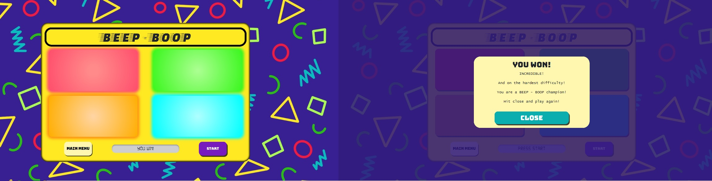
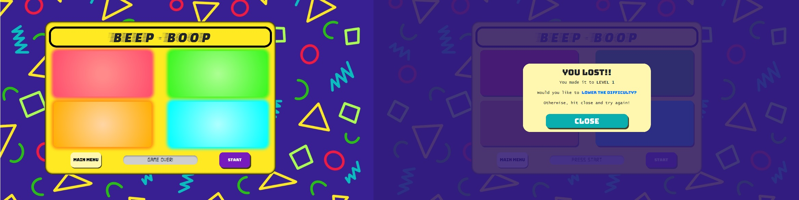
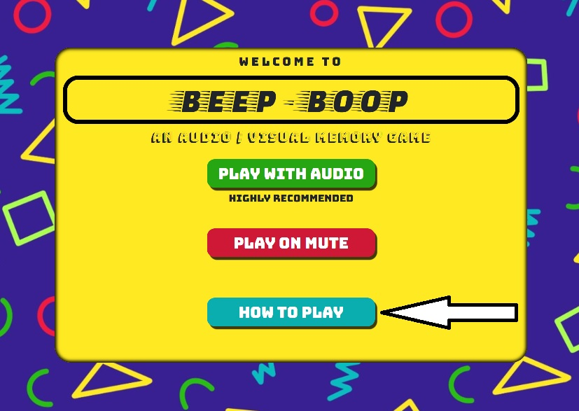
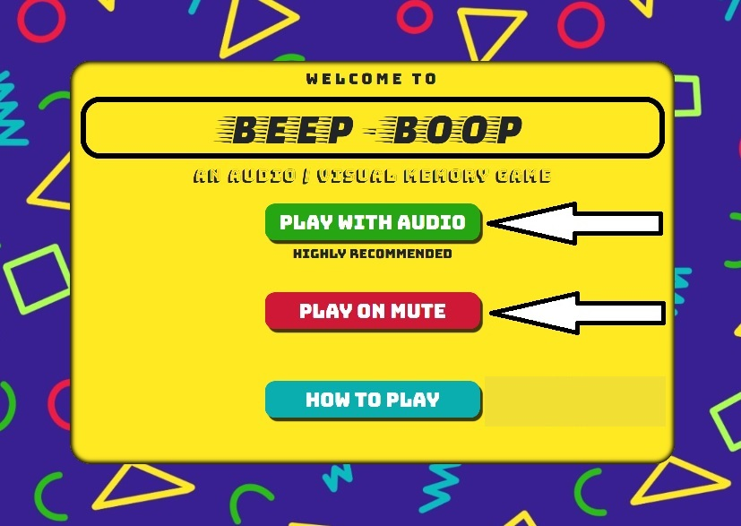
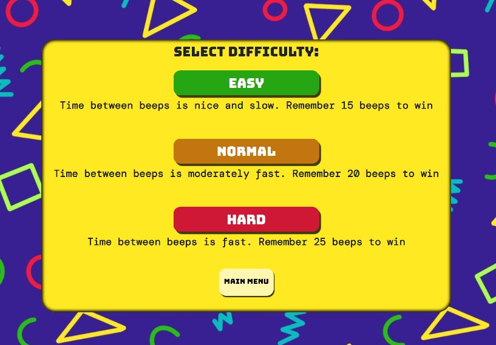

# Testing
[Click here to go to README file](README.md)

## Testing against user requirements (as listed in UX section)
### To play a memory game
This requirement is met by the website by providing a memory game!
  
### To interact with the website and gain immediate feedback from my interaction

The game responds to user clicks with immediate audio and visual feedback. If the user successfully completes the game, the level display shows **"YOU WIN!"** and a triumphant 8-bit jingle is sounded. Following this, a modal pops up to congratulate the user and if the game was played on easy or normal difficuly, suggests playing again on a higher difficulty with a link to difficulty.html.

If the user makes a mistake, the level display shows **"GAME OVER!"** and a game-over jingle sounds. The game-over jingle is reminiscent  of classic old-school arcade game game-over sounds. Following this, a modal pops up to say the game is over, inform the user of which level they reached, and if played on normal or hard difficulty, suggests playing the game on an easier difficulty with a link to difficulty.html. 
  
### The game to be simple to understand and play
The game is based on a very simple concept taken from the game 'Simon'. Whilst anyone familiar  with the game 'Simon' would immediately understand how to play, even without prior knowledge the user can quickly come to understand the rules of the game due to its simple nature and audio/visual feedback.
  
### To be able to read the game instructions should I need them

Should the user not understand the game, there is a clear **"HOW TO PLAY"** button presented on the landing page for the website. This page is easily accessible from anywhere on the website.

### To be able to play the game with or without sounds

This option is presented to the user immediately upon loading the website. On **index.html**, 2 buttons clearly state **"PLAY WITH AUDIO"** or **"PLAY ON MUTE"**. This page (signposted as **"MAIN MENU"**) is clearly accessible from anywhere within the website.
  
### To be able to change the difficulty of the game to be easier or harder

Having selected the audio setting, the users are presented with **difficulty.html**. On this page there are 3 buttons labelled **"EASY"**, **"NORMAL"** and **"HARD"**. Beneath the buttons is a short description of what each difficulty setting means.
  
### To be able to play the game on any device
The website has been designed and tested with the aim of enabling the game to be played on as many devices as possible. With this in mind, the CSS code has been made as cross browser compatible as possible with the help of [Autoprefixer](https://autoprefixer.github.io/). All code has been validated through [JS Hint](https://jshint.com/) for JavaScript, [W3C's](https://www.w3.org/) CSS and HTML validators. As well as this, the pages are all highly responsive with the design being suitable for devices of around a 270px square upwards.

## Validation
The HTML code has been checked against the [W3C Markup Validator](https://validator.w3.org/), the CSS against the [W3C CSS Validator](https://jigsaw.w3.org/css-validator/) and the JavaScript against the [JS Hint](https://jshint.com/) code analysis tool, with any issues highlighted by the validators fixed. The code contains no validity issues.

## Responsive testing
The website has been developed and tested to ensure a high level of responsiveness. This has been achieved using Google Chrome Dev Tools, testing on different physical devices and by viewing the site on [Am I Responsive?](http://ami.responsivedesign.is/).

## Manual testing of all elements throughout the website
The tests detailed in this section were all completed using the following web browsers and hardware:
|                            | Chrome             | Edge             | Firefox            | Safari |
| -------------             |:------------------:| -----------------:|-------------------:|--------:|
| Microsoft Surface 3 (15") | :heavy_check_mark: |:heavy_check_mark: | :heavy_check_mark: |         |
| Samsung Galaxy A6         | :heavy_check_mark: |:heavy_check_mark: | :heavy_check_mark: |         |
| Huawei P Smart 2019       | :heavy_check_mark: | :heavy_check_mark:| :heavy_check_mark: |         |
| Macbook Pro 2016 (13")    | :heavy_check_mark: |                   | :heavy_check_mark: |:heavy_check_mark: |
| iPad 7th generation 2019  | :heavy_check_mark: |                  | :heavy_check_mark: |:heavy_check_mark: |

### Index.html tests
Check that all text and buttons load with correct styles and spacing, and that the container is centred within the page. On mobile and tablet, rotate the screen to landscape orientation and repeat the checks.

#### "PLAY WITH AUDIO" button
1. Move mouse over button 
    * ensure hover effect is active.
2. Click on the button
    * Check that the box shadow effect is removed to give impression of button being pressed.
    * Check that button links to **difficulty.html**.
    * Within the console, ensure **"audio: 'true'"** has been saved to session storage.
  
#### "PLAY ON MUTE" button
1. Move mouse over button 
    * ensure hover effect is active.
  
2. Click on the button
    * Check that the box shadow effect is removed to give impression of button being pressed.
    * Check that button links to **difficulty.html**.
    * Within the console, ensure **"audio: 'false'"** has been saved to session storage.
  
#### "HOW TO PLAY" button
1. Move mouse over button 
    * ensure hover effect is active.
  
2. Click on the button
    * Check that the box shadow effect is removed to give impression of button being pressed.
    * Check that button triggers the **'HOW TO PLAY'** modal.

#### "HOW TO PLAY" modal
1. Display the modal using the **"HOW TO PLAY"** button
    * Check that the text and **"CLOSE"** button load with correct styles and spacing, and that the container is centred within the page. On mobile and tablet, rotate the screen to landscape orientation and repeat the checks.
  
2. Move mouse over **"CLOSE"** button 
    * ensure hover effect is active.
  
3. Click on the **"CLOSE"** button
    * Check that the box shadow effect is removed to give impression of button being pressed.
    * Ensure the modal is successfully closed.
  
4. Open modal and click outside of modal body
    * Ensure the modal is successfully closed.
  
### Difficulty.html
Check that all text and buttons load with correct styles and spacing, and that the container is centred within the page. On mobile and tablet, rotate the screen to landscape orientation and repeat the checks.

#### "EASY" button
1. Move mouse over button 
   * ensure hover effect is active.
  
2. Click on the button
   * Check that the box shadow effect is removed to give impression of button being pressed.
    * Within the console, check that **"difficulty: 'easy'"** is saved to session storage.
    * Check that button links to **game.html**.
  
#### "NORMAL" button
1. Move mouse over button 
    * ensure hover effect is active.
  
2. Click on the button
    * Check that the box shadow effect is removed to give impression of button being pressed.
    * Within the console, check that **"difficulty: 'normal'"** is saved to session storage.
    * Check that button links to **game.html**.

#### "HARD" button
1. Move mouse over button 
    * ensure hover effect is active.
  
2. Click on the button
   * Check that the box shadow effect is removed to give impression of button being pressed.
   * Within the console, check that **"difficulty: 'hard'"** is saved to session storage.
   * Check that button links to **game.html**.

#### "MAIN MENU" button
1. Move mouse over button 
   * ensure hover effect is active.
  
2. Click on the button
   * Check that the box shadow effect is removed to give impression of button being pressed.
   * Check that the button links to **index.html**.

### Game.html
Check that all text and buttons load with correct styles and spacing, and that the container is centred within the page. On mobile and tablet, rotate the screen to landscape orientation and repeat the checks.

For the purpose of speeding up testing, the number of beeps required to win was significantly lowered for all difficulty settings within the scripts.js file. In order to ensure the session storage was having the desired different outcomes whilst playing the game, 'Easy' mode required 3 successful repetitions, 'Normal' mode required 4 and 'Hard' mode required 5.

#### Game buttons (red, green, orange, blue)
1. Click on buttons
    * Play series of games, ensuring each of the buttons have been utilised within the games. 
    * Ensure the buttons trigger the correct audio and visual response.

#### "START" button
1. Move mouse over button 
    * ensure hover effect is active.
    
2. Click on the button
   * Check that the box shadow effect is removed to give impression of button being pressed.
   * Check that the button starts a new game.
   
#### Level display 
1. Play a game
    * Ensure the level display shows the correct level, and updates when new levels are reached.

2. Lose a game
    * Ensure the level display shows the text **"GAME OVER"**.
    
3. Win a game
    * Ensure the level display shows the text **"YOU WIN"**.
    
4. Click on **"START"** button during **winGame()** or **loseGame()** animation
    * Ensure level display shows **"PLEASE WAIT"** until animation is complete, then displays **"PRESS START"**.
    
5. Click on a game button whilst it's not the users turn
    * Ensure the level display shows **"PLEASE WAIT"** until it's the users turn, then display the current level.
    
#### "MAIN MENU" button
1. Move mouse over button 
   * ensure hover effect is active.
  
2. Click on the button
   * Check that the box shadow effect is removed to give impression of button being pressed.
   * Check that the button links to **index.html**.

#### Win game modal
1. Move mouse over **'CLOSE'** button 
   * Ensure hover effect is active.
   
2. Having won a game on easy or normal difficulty
    * Ensure the **"YOU WIN"** modal is triggered
    * On the modal, ensure link to **difficulty.html** is displayed, links correctly, and the hover effect is triggered when the mouse is moved over.
    
3. Having won a game on hard difficulty
    * Ensure the **"YOU WIN"** modal is triggered
    * On the modal, ensure the "Congratulations..." text is presented.
    
4. Click on the **"CLOSE"** button
    * Check that the box shadow effect is removed to give impression of button being pressed
    * Ensure the modal is successfully closed.
  
5. With the modal visible, click outside of modal body
    * Ensure the modal is successfully closed.

#### Lose game modal
1. Move mouse over **'CLOSE'** button 
   * ensure hover effect is active.
   
2. Having lost a game on normal or hard difficulty
    * Ensure the **"YOU LOST"** modal is triggered
    * On the modal, ensure link to **difficulty.html** is displayed, links correctly, and the hover effect is triggered when the mouse is moved over.
    
3. Having lost a game on easy difficulty
    * Ensure the **"YOU LOST"** modal is triggered
    
4. Click on the **"CLOSE"** button
    * Check that the box shadow effect is removed to give impression of button being pressed
    * Ensure the modal is successfully closed.
  
5. With the modal visible, click outside of modal body
    * Ensure the modal is successfully closed.
    
### Testing JavaScript functions and logic
1. Testing session storage data and outcomes
    * Navigate from **index.html** to **difficulty.html** using the **"PLAY WITH AUDIO"** button. On **difficulty.html**, navigate to **game.html** using **"EASY"** button.
    * Within the console in **game.html**, check session storage for **"audio: 'true'**, **difficulty: 'easy'**.
    * Using the **"START"** button, begin the game and check that the interval between beeps is as expected.
    * Ensure that the audio is playing.
    * Complete 3 successful repetitions and ensure the **winGame()** function is called.
    
Repeat these tests for all difficulty settings ensuring that the session storage data is correct for each instance. Ensure that the number of repetitions to win the game and the interval between beeps is as expected. Repeat for all difficulty settings again having selected **"PLAY ON MUTE"** from **index.html**, also ensuring that no audio is triggered.

2. Testing game functions (after pressing **"START"** button)
    * Ensure game begins.
    * Successfully repeat computer sequence - ensure a new round is started and that it is one beep longer than the previous round.
    * Enter incorrect sequence - ensure that the game ends and the **loseGame()** function is called and functions correctly (all game buttons flash two times, the level display states 'GAME OVER!', the lose game jingle sounds and the 'loseGame' modal is triggered).
    * Complete the game - ensure the **gameWin()** is called and functions correctly (all game buttons flash two times, the level display states 'YOU WIN!', the win game jingle sounds and the 'winGame' modal is triggered).
    * Press **'START'** button before game ends and during computers turn - ensure a new game is not started and the level display states "PLEASE WAIT".
    * Press **'START'** button before game ends and during users turn - ensure a new game is started.
    * Press **'START'** button during **winGame()** and **loseGame()** functions - ensure a new game is not started and the level display states "PLEASE WAIT".

### Additional Testing
* Friends and family asked to visit the website and report on any bugs or UX issues.
* Website posted to 'Peer Code Review' on the Code Institute Slack channel.
* No undocumented issues have been found.

### Found Bugs
During testing, a bug was found where if the user clicks on the **'START'** button whilst the **compPlay()** function is still being called by **setInterval()**. The **setInterval()** method fails to be cleared by the **interval ID** and therefore **compPlay()** gets stuck in a loop. To fix this issue, the **START** button only triggers a new game once the **setInterval()** method has been cleared. This means that a new game cannot be started whilst the **compPlay()** function is running. Instead, the level display tells the user to 'PLEASE WAIT' until the **START** button becomes functional again once the compPlay() function has stopped.
